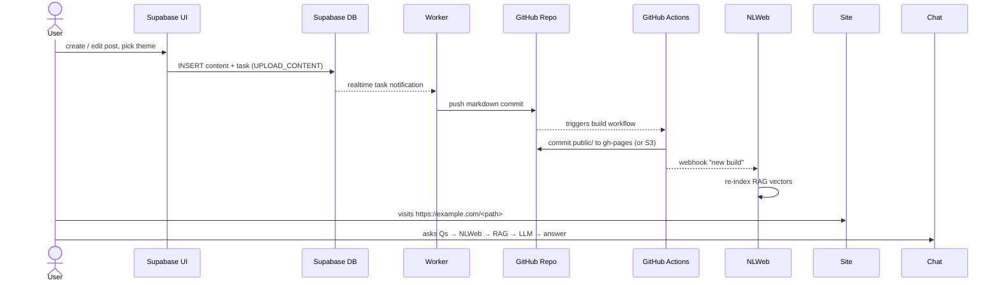

# Workflows and Process Documentation

## Overview

This document describes the key workflows and processes within the Multi-Tenant SaaS architecture, including task processing, content publishing, and automation flows.

## Core Workflow: Content Publishing

### Publish Task Flow



### Detailed Publishing Steps

1. **Content Creation**
   - User creates or edits content in the web interface
   - Content is saved as draft in the database
   - User selects theme and publishing options

2. **Task Creation**
   ```sql
   INSERT INTO tasks (site_id, type, payload, created_by) VALUES (
     'site-uuid',
     'PUBLISH',
     '{"content_id": "content-uuid", "target": "production"}',
     'user-uuid'
   );
   ```

3. **Worker Processing**
   - Worker receives real-time notification
   - Validates task and content
   - Converts content to Hugo-flavored markdown
   - Prepares file structure

4. **GitHub Integration**
   - Clone or pull target repository
   - Write content files to `sites/<section>/content/`
   - Commit changes to temporary branch
   - Create pull request or push directly

5. **CI/CD Pipeline**
   - GitHub Actions triggered by push
   - Hugo build process generates static site
   - Deploy to target environment (GitHub Pages, S3, CDN)

6. **Post-Deploy Actions**
   - Update task status to SUCCEEDED/FAILED
   - Trigger search index updates
   - Send notifications to relevant users

## Task Processing Architecture

### Task Types and Handlers

#### UPLOAD_CONTENT
```typescript
interface UploadContentTask {
  type: 'UPLOAD_CONTENT';
  payload: {
    content_id: string;
    assets: string[];
    target_branch?: string;
  };
}
```

**Process:**
1. Fetch content and associated assets
2. Process markdown and convert media
3. Upload assets to appropriate storage
4. Update content with final asset URLs

#### GENERATE_CONTENT
```typescript
interface GenerateContentTask {
  type: 'GENERATE_CONTENT';
  payload: {
    prompt: string;
    content_type: 'post' | 'page';
    site_id: string;
    auto_publish?: boolean;
  };
}
```

**Process:**
1. Send prompt to AI service
2. Generate content based on site context
3. Create draft content in database
4. Optionally trigger publish workflow

#### REBUILD_SITE
```typescript
interface RebuildSiteTask {
  type: 'REBUILD_SITE';
  payload: {
    site_id: string;
    trigger_reason: string;
    full_rebuild?: boolean;
  };
}
```

**Process:**
1. Fetch all published content for site
2. Regenerate all static files
3. Trigger complete site rebuild
4. Update deployment status

#### RESEARCH
```typescript
interface ResearchTask {
  type: 'RESEARCH';
  payload: {
    topic: string;
    site_id: string;
    content_suggestions?: boolean;
    create_draft?: boolean;
  };
}
```

**Process:**
1. Research topic using external APIs
2. Compile findings and sources
3. Generate content suggestions
4. Optionally create draft posts

### Worker Service Implementation

#### Task Polling Strategy
```typescript
class TaskWorker {
  async pollTasks() {
    const tasks = await supabase
      .from('tasks')
      .select('*')
      .eq('status', 'QUEUED')
      .lte('scheduled_for', new Date().toISOString())
      .order('priority', { ascending: false })
      .order('created_at', { ascending: true })
      .limit(10);

    for (const task of tasks.data || []) {
      await this.processTask(task);
    }
  }

  async processTask(task: Task) {
    try {
      // Update status to RUNNING
      await this.updateTaskStatus(task.id, 'RUNNING');
      
      // Execute task based on type
      const result = await this.executeTask(task);
      
      // Update status to SUCCEEDED
      await this.updateTaskStatus(task.id, 'SUCCEEDED', result);
    } catch (error) {
      // Handle failure and retry logic
      await this.handleTaskFailure(task, error);
    }
  }
}
```

#### Real-time Task Processing
```typescript
class RealtimeTaskWorker {
  constructor() {
    this.setupRealtimeSubscription();
  }

  setupRealtimeSubscription() {
    supabase
      .channel('task-changes')
      .on('postgres_changes', 
        { event: 'INSERT', schema: 'public', table: 'tasks' },
        (payload) => this.handleNewTask(payload.new)
      )
      .subscribe();
  }

  async handleNewTask(task: Task) {
    // Immediate processing for high-priority tasks
    if (task.priority > 50) {
      await this.processTask(task);
    }
  }
}
```

## GitHub Repository Management

### Repository Template Structure
```
tenant-repo/
├── .github/
│   └── workflows/
│       ├── build.yml
│       └── deploy.yml
├── sites/
│   ├── blog/
│   │   ├── config.yaml
│   │   ├── content/
│   │   ├── themes/
│   │   └── static/
│   └── projects/
│       ├── config.yaml
│       └── content/
├── docker/
│   └── nlweb/
│       ├── Dockerfile
│       └── helm/
├── scripts/
│   ├── setup.sh
│   └── deploy.sh
└── README.md
```

### GitHub Actions Workflows

#### Build Workflow (build.yml)
```yaml
name: Build Sites
on:
  push:
    paths:
      - 'sites/**'
  workflow_dispatch:

jobs:
  build:
    runs-on: ubuntu-latest
    strategy:
      matrix:
        site: [blog, projects]
    
    steps:
      - uses: actions/checkout@v3
      
      - name: Setup Hugo
        uses: peaceiris/actions-hugo@v2
        with:
          hugo-version: 'latest'
          
      - name: Build Site
        run: |
          cd sites/${{ matrix.site }}
          hugo --minify
          
      - name: Upload Artifacts
        uses: actions/upload-artifact@v3
        with:
          name: ${{ matrix.site }}-public
          path: sites/${{ matrix.site }}/public/
```

#### Deploy Workflow (deploy.yml)
```yaml
name: Deploy Sites
on:
  workflow_run:
    workflows: ["Build Sites"]
    types: [completed]

jobs:
  deploy:
    if: ${{ github.event.workflow_run.conclusion == 'success' }}
    runs-on: ubuntu-latest
    
    steps:
      - name: Download Artifacts
        uses: actions/download-artifact@v3
        
      - name: Deploy to GitHub Pages
        uses: peaceiris/actions-gh-pages@v3
        with:
          github_token: ${{ secrets.GITHUB_TOKEN }}
          publish_dir: ./public
          
      - name: Notify Webhook
        run: |
          curl -X POST ${{ secrets.WEBHOOK_URL }} \
            -H "Content-Type: application/json" \
            -d '{"event": "deploy_complete", "site": "${{ matrix.site }}"}'
```

## Automation Workflows

### Scheduled Content Publishing

#### Daily Content Review
```sql
-- Function to queue daily content review tasks
CREATE OR REPLACE FUNCTION queue_daily_content_review()
RETURNS void AS $$
BEGIN
  -- Find scheduled content that should be published
  INSERT INTO tasks (site_id, type, payload, account_id)
  SELECT 
    site_id,
    'PUBLISH' as type,
    json_build_object('content_id', id, 'scheduled', true) as payload,
    (SELECT account_id FROM sites WHERE sites.id = content.site_id)
  FROM content 
  WHERE status = 'scheduled' 
    AND scheduled_for <= NOW()
    AND scheduled_for > NOW() - INTERVAL '1 day';
    
  -- Queue research tasks for active sites
  INSERT INTO tasks (site_id, type, payload, account_id)
  SELECT 
    id as site_id,
    'RESEARCH' as type,
    json_build_object('auto_research', true) as payload,
    account_id
  FROM sites 
  WHERE settings->>'auto_research' = 'true'
    AND last_built_at < NOW() - INTERVAL '7 days';
END;
$$ LANGUAGE plpgsql;
```

#### Cron Job Setup
```sql
-- Setup cron job for daily tasks (requires pg_cron extension)
SELECT cron.schedule('daily-content-review', '0 9 * * *', 'SELECT queue_daily_content_review();');
```

### Content Enhancement Automation

#### AI-Powered Content Suggestions
```typescript
interface ContentEnhancementWorkflow {
  async enhanceContent(contentId: string) {
    // Analyze existing content
    const content = await this.getContent(contentId);
    
    // Generate SEO improvements
    const seoSuggestions = await this.generateSEOSuggestions(content);
    
    // Create related content ideas
    const relatedTopics = await this.generateRelatedTopics(content);
    
    // Queue improvement tasks
    await this.queueEnhancementTasks(contentId, {
      seoSuggestions,
      relatedTopics
    });
  }
}
```

## Error Handling and Recovery

### Task Retry Logic
```typescript
class TaskRetryHandler {
  async handleTaskFailure(task: Task, error: Error) {
    const retryCount = task.retry_count + 1;
    
    if (retryCount <= task.max_retries) {
      // Exponential backoff
      const delay = Math.min(300 * Math.pow(2, retryCount), 3600); // Max 1 hour
      const scheduledFor = new Date(Date.now() + delay * 1000);
      
      await supabase
        .from('tasks')
        .update({
          status: 'QUEUED',
          retry_count: retryCount,
          scheduled_for: scheduledFor.toISOString(),
          error_message: error.message
        })
        .eq('id', task.id);
    } else {
      // Mark as failed after max retries
      await supabase
        .from('tasks')
        .update({
          status: 'FAILED',
          error_message: error.message,
          completed_at: new Date().toISOString()
        })
        .eq('id', task.id);
        
      // Notify administrators
      await this.notifyTaskFailure(task, error);
    }
  }
}
```

### Monitoring and Alerting
```typescript
interface MonitoringService {
  async checkSystemHealth() {
    // Check task queue health
    const queuedTasks = await this.getQueuedTaskCount();
    const failedTasks = await this.getFailedTaskCount();
    
    // Check worker responsiveness
    const workerStatus = await this.checkWorkerHealth();
    
    // Check GitHub API limits
    const githubLimits = await this.checkGitHubLimits();
    
    return {
      queuedTasks,
      failedTasks,
      workerStatus,
      githubLimits
    };
  }
}
```

## Performance Optimization

### Database Query Optimization
- Use appropriate indexes for tenant-scoped queries
- Implement query result caching for frequently accessed data
- Optimize real-time subscriptions to reduce database load

### Task Processing Optimization
- Implement task priority queues
- Use batch processing for similar tasks
- Implement circuit breakers for external service calls

### Storage Optimization
- Implement CDN for asset delivery
- Use image optimization and compression
- Implement storage cleanup for unused assets